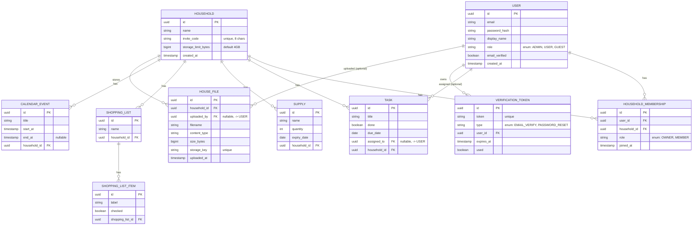

# Entity-Relationship Diagram

Every JPA entity in `backend/src/main/java/be/househub/backend/entity`, as of the
multi-household-membership + house-files changes. Renders natively on GitHub and in VS
Code's Markdown preview (Mermaid).

## Notes

- **`HOUSEHOLD_MEMBERSHIP`** is the User↔Household join, but it carries its own attribute
  (`role`: OWNER/MEMBER per membership) so it's modeled as a first-class entity rather than
  a plain `@ManyToMany` join table — a user can belong to any number of households, each
  with its own role, and `(user_id, household_id)` is unique.
- **`TASK.assigned_to`** and **`HOUSE_FILE.uploaded_by`** are the only nullable FKs to
  `USER` — a task can be unassigned, and a file's uploader can go unset (e.g. if the
  uploading user is later removed without cascading the file).
- All other domain tables (`TASK`, `SUPPLY`, `SHOPPING_LIST`, `CALENDAR_EVENT`,
  `HOUSE_FILE`) hang directly off `HOUSEHOLD`, each in its own table — that separation
  (e.g. files vs. tasks) already falls out of normal entity-per-table modeling; there was
  never a shared "everything" table to split apart.
- `VERIFICATION_TOKEN` belongs to `USER` only (email verification / password reset), not
  to a household.
- Schema is created via Hibernate `ddl-auto=update` (no Flyway/Liquibase in this project) —
  see `backend/src/main/resources/application-{dev,docker}.properties`.
